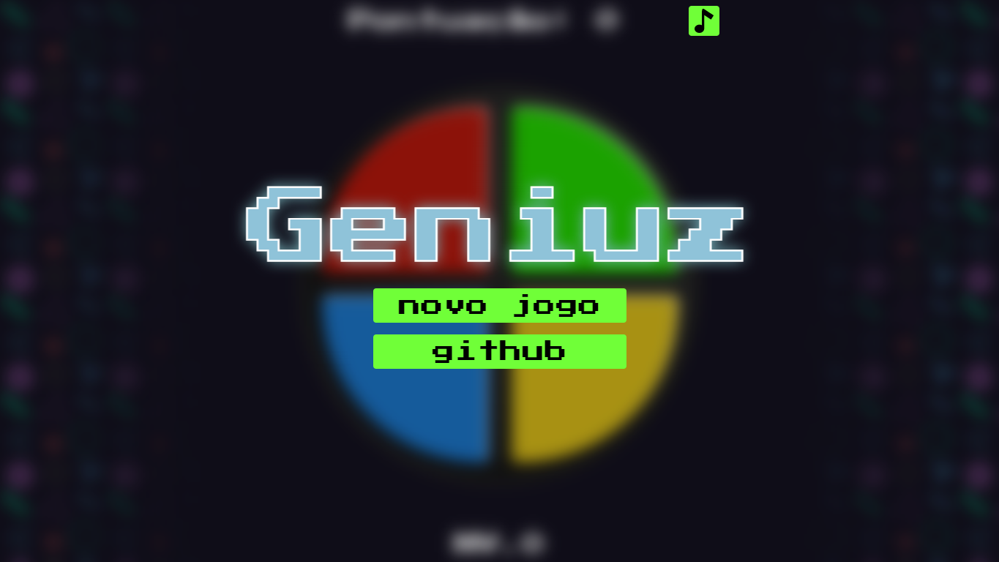
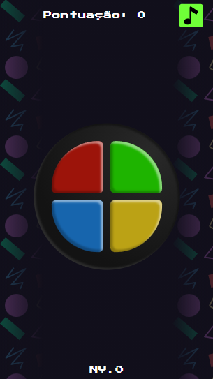
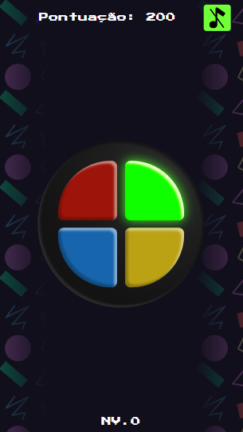
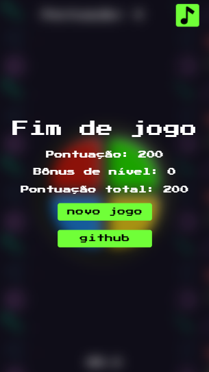
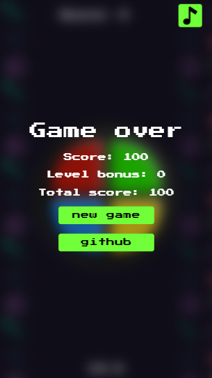

# Que bom ter você por aqui! 

## 🎮 Jogue em: [joseliojunior.github.io/geniuz/](joseliojunior.github.io/geniuz/)

&nbsp;&nbsp;&nbsp;&nbsp; Este é um projeto é baseado nos jogos Genius (Brasil) e Simon (mudialmente) que teve sua maior popularidade entre os anos 80 aos anos 2000.

> ℹ A tradução do jogo ocorre de forma automática baseado no idioma do navegador.

|Tela inicial|
|-|
||

|Tela neutra|Brilhando e sem som|
|-|-|
|||

|Fim de jogo (pt-br)|Fim de jogo (en-us)|
|-|-|
|||

<b>Josélio de S. C. Júnior - 2021</b>

